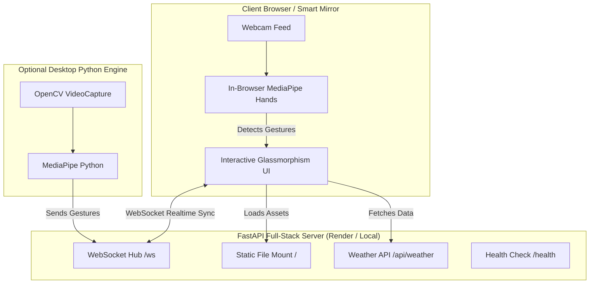

# 🪞 Touchless Smart Mirror & Computing Interface

A full-stack, gesture-controlled smart computing mirror interface powered by **FastAPI**, **WebSockets**, and **MediaPipe Hands** computer vision.

Control photos, weather, and ambient metrics completely touch-free using natural hand gestures through your camera — running both locally and deployed live to **Render**.

---

## 🌟 Key Features

- **Touchless Air Gestures**:
  - 👋 **Swipe Left / Right**: Next / previous photo in the gallery.
  - 👌 **Pinch Thumb & Index**: Toggle temperature between Celsius (°C) and Fahrenheit (°F).
  - ⌨️ **Keyboard Fallback**: `←`, `→` arrow keys and `Space` for testing without a webcam.
- **In-Browser Computer Vision**: Runs real-time MediaPipe Hand tracking directly in the web browser (laptop, tablet, phone) with an interactive cybernetic HUD skeleton overlay.
- **Full-Stack Cloud Architecture**: Unified FastAPI backend serving the responsive glassmorphic frontend, real-time WebSockets (`/ws`), and weather API (`/api/weather`).
- **Cross-Display Real-Time Synchronization**: Any gesture performed on one screen broadcasts via WebSockets to all connected mirrors in real time.
- **Desktop OpenCV Engine (Optional)**: Includes a standalone Python computer vision desktop controller (`backend/motion_engine.py`).
- **Production-Ready for Render**: Pre-configured with `render.yaml`, `Procfile`, and lightweight `requirements.txt`.

---

## 🏗️ Architecture



---

## 🚀 Quick Start (Run Locally)

### 1. Clone & Enter the Directory
```bash
cd "smart computing"
```

### 2. Install Server Dependencies
```bash
pip install -r requirements.txt
```

### 3. Start the Full-Stack Server
```bash
python server.py
```
Or with Uvicorn:
```bash
uvicorn server:app --host 0.0.0.0 --port 8000 --reload
```

### 4. Open in Your Browser
Visit [http://localhost:8000](http://localhost:8000) in Chrome, Edge, or Safari.
- Click **"Enable Camera"** in the top-right header to activate touchless air gesture control!
- Try swiping left/right or pinching in front of your camera.

---

## ☁️ Deploying to Render

This repository is pre-configured for **Render** (as a Web Service with free-tier support).

### Method A: 1-Click Blueprint (Recommended)
1. Push this project to your GitHub repository.
2. Log in to [Render.com](https://dashboard.render.com).
3. Click **"New"** -> **"Blueprint"**.
4. Connect your GitHub repository.
5. Render will automatically detect [`render.yaml`](file:///c:/Users/admin/Documents/Programs/smart%20computing/render.yaml) and configure:
   - **Runtime**: `Python 3`
   - **Build Command**: `pip install -r requirements.txt`
   - **Start Command**: `uvicorn server:app --host 0.0.0.0 --port $PORT`
   - **Health Check**: `/health`
6. Click **"Apply"**. Your full-stack touchless mirror will be live in 1–2 minutes!

---

### Method B: Manual Web Service Setup on Render
1. In the Render Dashboard, click **"New"** -> **"Web Service"**.
2. Connect your Git repository.
3. Configure the following fields:
   - **Name**: `touchless-smart-computer`
   - **Language**: `Python 3`
   - **Branch**: `main` (or `master`)
   - **Build Command**: `pip install -r requirements.txt`
   - **Start Command**: `uvicorn server:app --host 0.0.0.0 --port $PORT`
   - **Health Check Path**: `/health`
4. Click **"Create Web Service"**.

---

## 🖥️ Optional Desktop Python Controller

If you want to run the native desktop Python OpenCV motion engine:

```bash
pip install -r backend/requirements-desktop.txt
python backend/motion_engine.py
```
This opens your local OpenCV webcam window with real-time landmark tracking and connects to the active interface.

---

## 📁 Repository Structure

```
smart computing/
├── server.py                        # Unified FastAPI full-stack server
├── requirements.txt                 # Production dependencies for Render
├── render.yaml                      # Render Blueprint configuration
├── Procfile                         # Process declaration for cloud platforms
├── .gitignore                       # Ignored files (caches, virtual environments)
├── README.md                        # Documentation and deployment guide
│
├── frontend/                        # Web Application Interface
│   ├── index.html                   # Semantic HTML5 Smart Mirror layout
│   ├── style.css                    # Glassmorphism aesthetic theme & animations
│   └── app.js                       # MediaPipe vision, gesture logic & WebSockets
│
└── backend/                         # Desktop Python Engine
    ├── motion_engine.py             # Standalone OpenCV + MediaPipe tracker
    └── requirements-desktop.txt     # Dependencies for desktop OpenCV tracking
```

---

## 🛡️ License

MIT License. Free for open-source and educational use.
